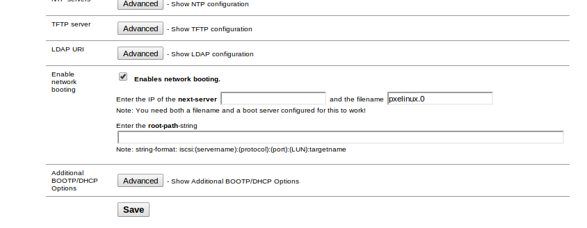

ubuntu-netboot-tftp
===================

Automating server installation by using [PXE boot](http://en.wikipedia.org/wiki/Preboot_Execution_Environment) and the [Ubuntu](http://www.ubuntu.com) 14.04 LTS
netboot image over [TFTP](https://en.wikipedia.org/wiki/Trivial_File_Transfer_Protocol).

### Requirements

- a PXE-capable BIOS and NIC
- DHCP server serving 172.16.0.0/24 ip's
- TFTP server (see below) at 172.16.0.1

### Usage

- customize `hostnames` (mac address to hostname mappings)
- customize `preseed.cfg` with your values

#### Why 172.16.x.x?

It doesn't get in the way of my home networking! You're welcome to change this in `postpreseed.sh`.

### PXE

The PXE boot automates server installation. We use a [preseed config](preseed.cfg) delivered over [TFTP](https://en.wikipedia.org/wiki/Trivial_File_Transfer_Protocol).
See `ubuntu-installer/amd64/boot-screens/txt.cfg` (line 6).

#### Setup with [pfSense](http://www.pfsense.org/) (tested on versions 2.0.3 and 2.1)

- Install the TFTP package (`System` > `Packages`)
- Under `System` > `Advanced` > `Firewall / NAT` deselect any interface for `TFTP Proxy` and save
- Under `Services` > `TFTP` select the LAN interface for `TFTP Daemon Interfaces` and save
- SSH into your pfSense appliance (enable SSH access and add a rule to allow port 22)
- Install curl: `pkg_add -r curl` and rehash: `rehash`
- `curl -sL https://github.com/analytically/ubuntu-netboot-tftp/tarball/master | tar -xf -`
- `cd analytically-ubuntu-netboot-tftp-4753507ab5c9bca0599c85f0401108c1059da0c9/` (the directory has another hash)
- `mv analytically-ubuntu-netboot-tftp-4753507ab5c9bca0599c85f0401108c1059da0c9/* /tftpboot`
- `rm -R analytically-ubuntu-netboot-tftp-4753507ab5c9bca0599c85f0401108c1059da0c9`
- Configure `Enable network booting` under the LAN DHCP server config under `Services` > `DHCP Server`, see below:

- click `Save`, and `Apply changes`, this will restart the DHCP service on your pfSense. You can now use PXE/Network boot.

### After installation

- user: ansibler, password: PQmb6JxU
- continue with my [Hadoop Ansible Playbook](https://github.com/analytically/hadoop-ansible)

### Warning

The `ubuntu-installer/amd64/initrd.gz` archive contains a workaround to get TFTP and preseed.cfg working together (see `/usr/lib/fetch-url/tftp`)
with [pfSense](http://www.pfsense.org/). The bug in `debian-installer-utils` is reported [here](http://bugs.debian.org/cgi-bin/bugreport.cgi?bug=707955).

### License

Licensed under the [Apache License, Version 2.0](http://www.apache.org/licenses/LICENSE-2.0).

Copyright 2013-2014 [Mathias Bogaert](mailto:mathias.bogaert@gmail.com).